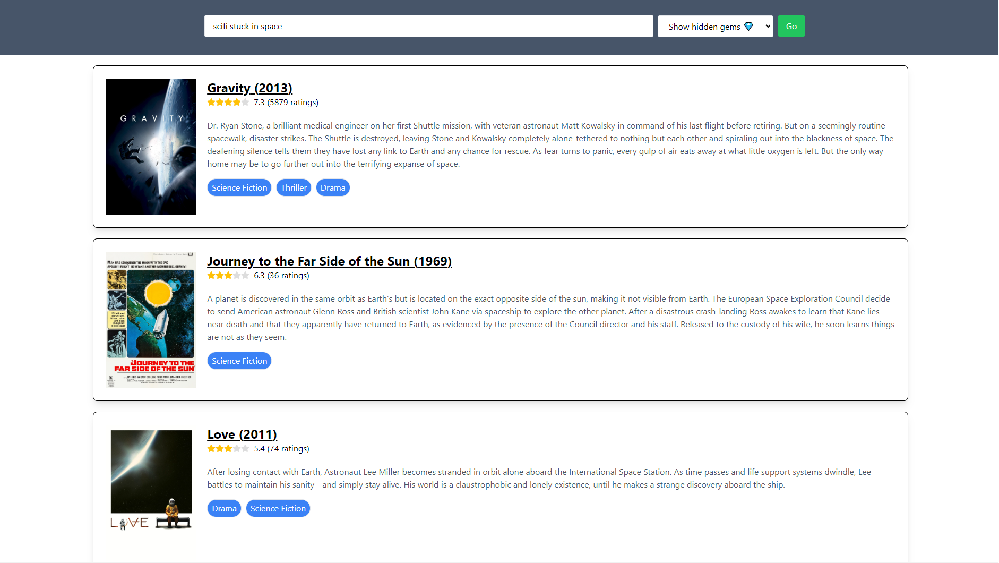

🚧 *This is still a work in progress. Expect active development and refactoring.*

## Movie Recommender
Find movies to watch by describing plot themes like "scifi stuck in space", “2 dudes goofing around comedy” and “time travel romance”.

Live Demo: [https://nlp-movie-recommender.fly.dev](https://nlp-movie-recommender.fly.dev)

Or click the image for a demo video on YouTube:

## Other Details
- 🛠️ Tech Stack
    - This is a Django app with React embedded within to provide a smoother search experience with an SPA.
    - Deployed through fly.io
- 🛢 Data: 
    - The movie database being search over is from ["The Movies Dataset"](https://www.kaggle.com/datasets/rounakbanik/the-movies-dataset) on Kaggle, but with poster URLs fixed (when available from TMDB). 
    - This being a static data snapshot from 2018 means the search app doesn't have recent movies.